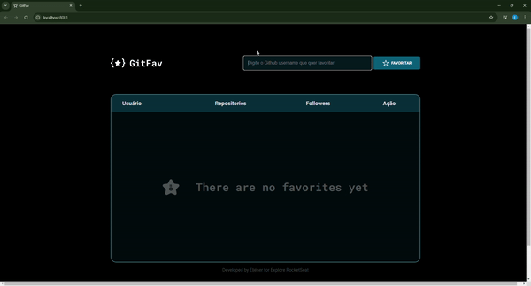

<h1 align="center">GitFav</h1>
 

  

 

## Projeto Rocketseat Explore

O projeto GitFav é um exemplo de uma aplicação web bem estruturada que utiliza técnicas modernas de JavaScript, como programação orientada a objetos, operações assíncronas, e manipulação dinâmica do DOM. A modularização do código, juntamente com o uso de armazenamento de informações do usuário através do local storage, garante uma aplicação organizada e eficiente. Além disso, o tratamento de eventos e erros assegura que a aplicação seja robusta e ofereça uma boa experiência ao usuário.
 

## Tecnologias

  
  
  
  
  
  
  

 

###

---

Developed by Eliéser for Explore RocketSeat [LinkedIn](https://www.linkedin.com/in/eli%C3%A9ser-nascimento-2b77b010a/) e [GitHub](https://github.com/navybrasil)
